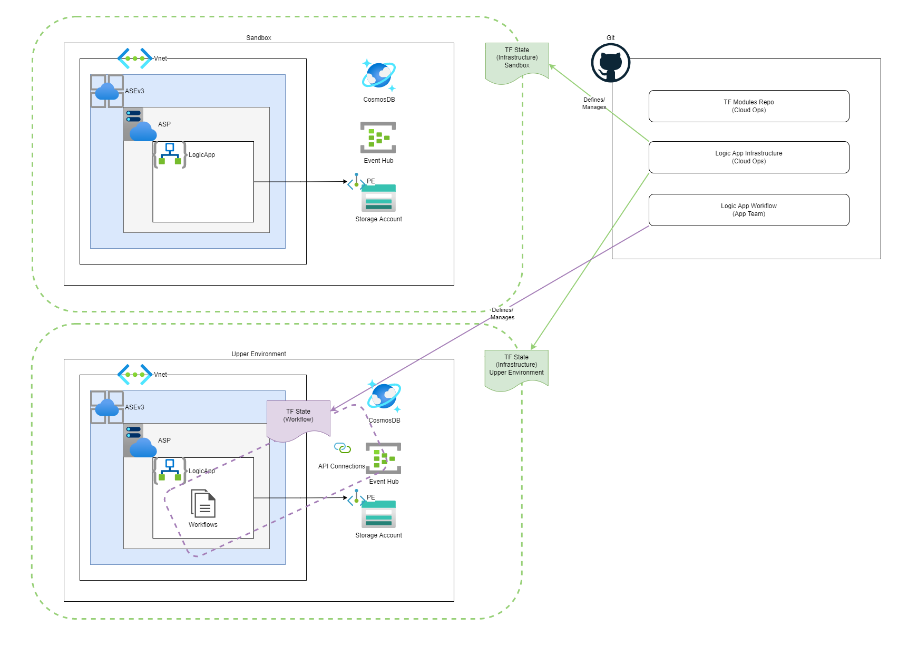

# logicapp-infra
* This repository is for creating the Logic App Infrastructure. For Workflows please look at [logicapp-workflows](https://github.com/implodingduck/logicapp-workflows)
* Logic App Infrastructure Repository that creates the following items:
  * Standard Logic App
  * Storage Account
  * Event Hub
  * CosmosDB 
  * Key Vault



Since we want to allow the app team to create the custom app settings we can add the following to the standard logic app definition:
```
lifecycle {
    ignore_changes = [
      app_settings
    ]
}
```